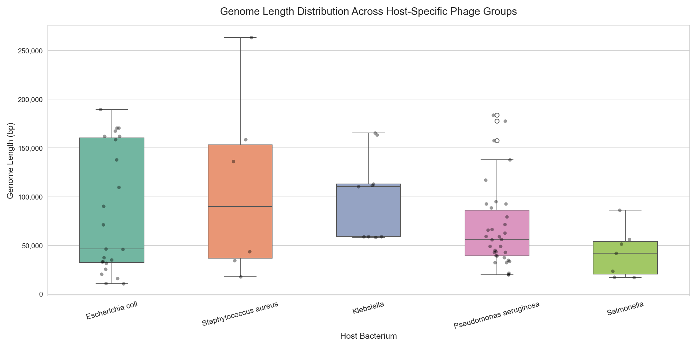
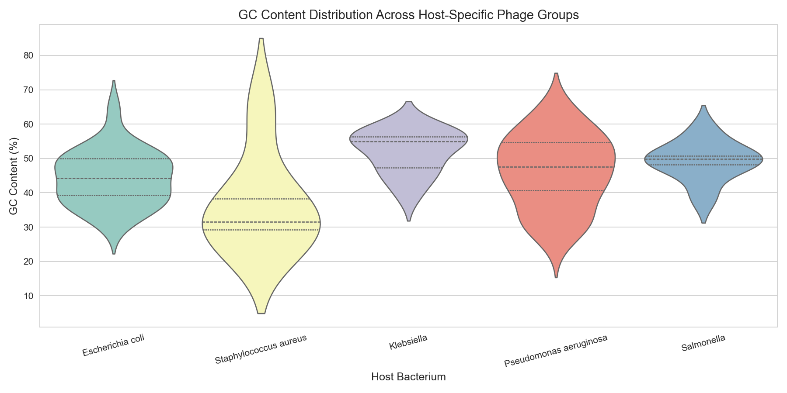
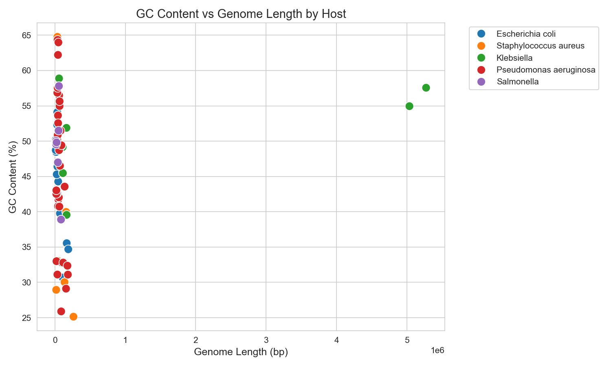
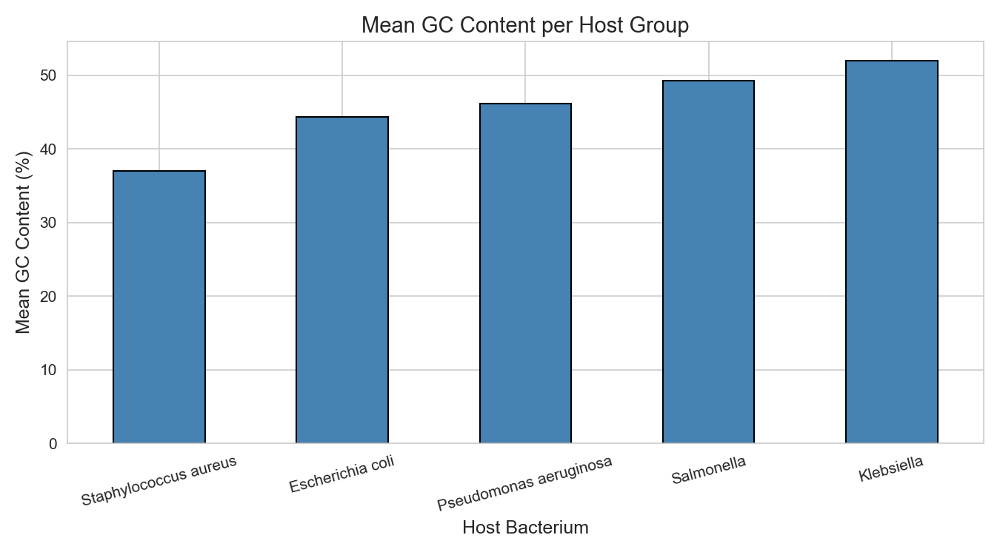
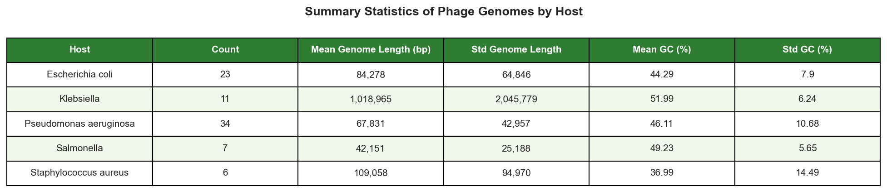

# Comparative Genomic Analysis of Bacteriophage Host Adaptation

## Overview
Comparative genomic analysis of 81 bacteriophage genomes across 5 bacterial 
hosts to study genome-level patterns associated with host adaptation using 
real data from NCBI Nucleotide Database.

## Hosts Studied
- Escherichia coli
- Staphylococcus aureus
- Klebsiella pneumoniae
- Pseudomonas aeruginosa
- Salmonella enterica

## Tools & Libraries
- Python, Biopython, Pandas, Matplotlib, Seaborn
- Data sourced from NCBI Nucleotide Database via Entrez API

## Key Findings
- Staphylococcus aureus phages show the lowest GC content (~37%), 
  consistent with their AT-rich host genome
- Klebsiella phages show the highest GC content (~52%)
- Host GC composition is a major driver of phage GC content, 
  supporting co-evolutionary adaptation
- GC content and genome length are independently evolving features

## Plots






## How to Run
Clone the repository and install dependencies:
```bash
pip install biopython pandas matplotlib seaborn jupyter
jupyter notebook phage_analysis.ipynb
```

## Project Structure
```
comparative-phage-genomics/
├── README.md
├── phage_analysis.ipynb    ← main analysis notebook
├── phage_genomes.csv       ← dataset fetched from NCBI
├── .gitignore
└── plots/
    ├── genome_length_distribution.png
    ├── gc_content_distribution.png
    ├── gc_vs_length_scatter.png
    ├── mean_gc_per_host.png
    └── summary_table.png
```
